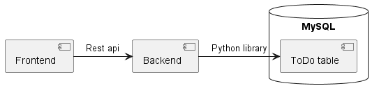

# ToDo
## Description
This is a very simple application that takes care of your To-Do list. You can add items and check them off as you complete them. To achive this we use three separate components, one container for the Frontend, another for the Backend to comunicate exact requests to the third component the MySQL database. 

## Architecture
We use a API Gateway architecture. The Frontend acts as the API in this case, it's job is to recive requests from the user and forward them to the appropriate endpoint in the Backend. Indeed he is not even allowed to fetch the list of todo items from the database to display them to the user, something quite trivial. This has the advantage of making the Frontend completely independant of both the Backend and the Database. 

The Backend in turn takes care of any requests coming it's way, only from the Frontend at this time. He in turn gets any information he needs from the database to forfill the action. Currently there are only three actions avilable; adding an item to the todo list, getting the todo list or changing and items current status. 

The database is a MySQL database and has one table, the ToDo. It only has tree column, id, status and description. Id is an integer and the primary key, status is a boolean and defaults to False and lastly description which of type Text. 
|id | status | description |
|--|--|--|
|Int | Bool | Text |

This image also describes how the different components relates to one another: 

## Improvements and security
One of the "features" of the current system is that we only have one list to add to. So regardless of who access the system you will always see the same list. Usefull perhaps in a faily setting where you want to keep track of which of the household chores has been completed. Bur that is rarely the case and most people want to keep their own list, not battle with the rest of the world for space. 
To properly solve this issue one should implement users. With a login and everything. Then we would add more tables to the database to keep track ov everyone and which todo lists they owned. 

As for current sercurity, there is not a lot of it. The most notable security measure is in the docker compose file. Only the Frontend has an exposed port to the world outside of docker and the database and Backend sit hidden behind the docker network. One could argue that this is perhaps expected behavior and not something to crow home about. Still it's the only really security related thing in this implementation. 

One concrete change that could be done is to note have code in the `__init__.py` files as no one expects code to be in there usually. As this project was built with a time limit code from a previous project was reused. The function inside the `__init__.py` file should be moved to the `app.py` respectively `server.py` files. 

A link to the [GitHub repo](https://github.com/s02blom/Cloud-BuildSomething). 

This report and project was made by [Sofia Blom](https://github.com/s02blom). BTH email: sobl21@student.bth.se